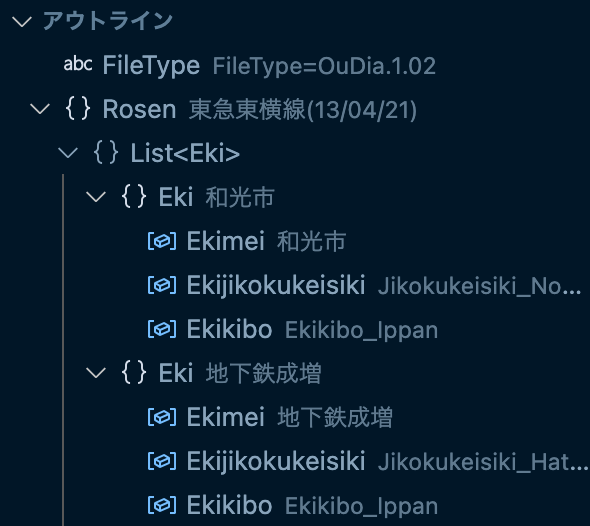
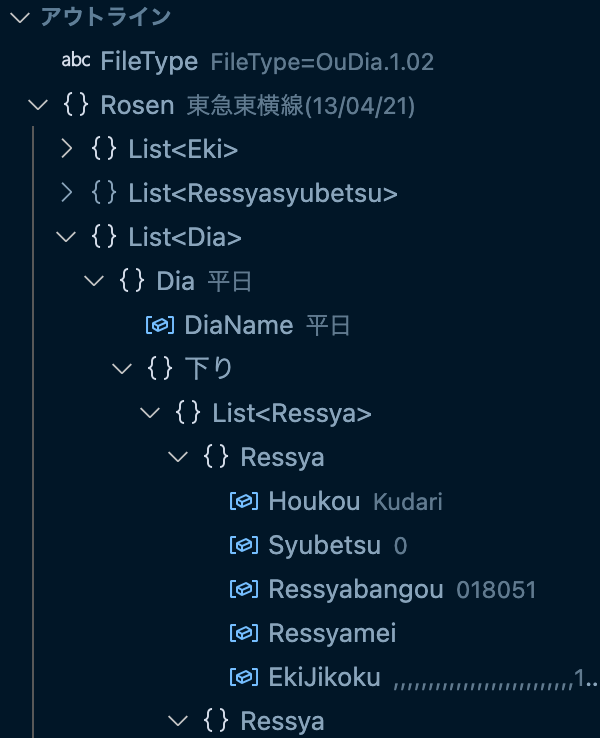

https://marketplace.visualstudio.com/items?itemName=up-tri.oud-intellisense

# oud-intellisense

- syntax highlighting for OuDia file (.oud) and OuDiaSecond file (.oud2).
- open/close support for each namespaces.
- outline view.

outline view sample

## Release Notes

see [CHANGELOG.md](https://github.com/up-tri/oud-intellisense/blob/master/CHANGELOG.md)

## developer

- up-tri
  email: yaki-shake@up-tri.me
